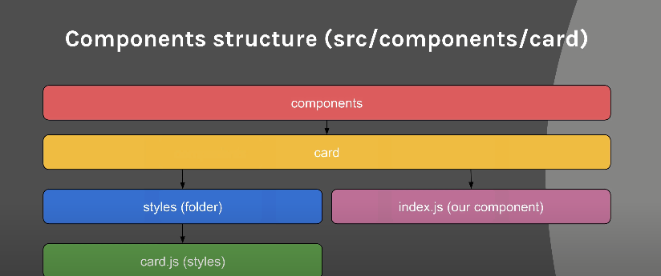

========== Netflix application Clone ==========

- Website link if you want to visit it

       https://netflix-clone-applications.netlify.app/

- git push -u origin master --verbose
- git push -f origin master

- Create a react app:

       yarn create react-app name

- Dependencies installation

      1- yarn add styled-components
      2- yarn add firebase 
      3- yarn add fuse.js
      4- yarn add normalize.css
      5- yarn add react-router-dom
  
      For more infor. look inside of the package.json file

      lsof  -i :3000 kill:5000
- Run the app on your own computer 
      
      1- Just create a firebase web setup
      2- Replace the content of lib folder with your own firebase credentials
      3-  yarn or npm install to install all the dependencies
      4- You can also delete the test folder if you don't want to deal with testing at all
      5- You good to go!

- Why this project?
       
      This application has been built with react and firebase 
      but more importantly, we also have styled components which really 
      help structure all the code in the very nice way to follow.
  
      Having the code source and really taking a deep look at it
      can really help you become a better developer and writing a better at
      at writing understandable and well writing code.

- Deployment 

      1- yarn or npm run build
      2- Go to netlify and drag your build folder and the rest is
        personal configuration.
      

  
      ======== Application architecture ======

     ======== Component architecture ======

    ======== Folder architecture ======

    ======== Banner ======

    ======== Accordion ======

    ======== Sign In ======

    ======== Sign up ======

    ======== Home Pages ======

    ======== Welcome ======

    ======== Card ======

    ======== Foter ======

